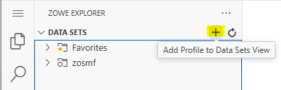

# OPS/MVS LAB

In this lab, you are going to write a small program, and an OPS/MVS Automation Rule. Then you will enable the automation rule, run the program to trigger your rule, and finally verify your automation by viewing its output in your OPSLOG. 

If you run into any snags, simply raise your hand and a facilitator will come over to help you debug. 

## Getting Started

1. Login to the workshop system using the given URL, username, and password, and follow the steps your instructor provides.

2. Verify that you are in the `ops-mvs` workspace.

3. Select the VS Code Icon to launch your VS Code Environment.

4. Wait for the VS Code environment to load.

5. You are now in the secure cloud environment which runs VS Code and is connected to the Mainframe.

## Load your datasets

1. Select the Zowe Explorer Icon (Z icon in the VS Code Activity Bar).

2. Hover over the “zftp” item in the DATA SET section of the sidebar and click on the magnifier icon. (NOTE: if the “zftp” item is not present, follow step 2a below) 

2a.1 Click on the plus icon (+) to the right of the DATA SETS section.

2a.2 Select the `zftp` profile from the drop down menu.

2a.3 Select “Apply to all trees”.

3. Enter `OPSMVS.LAB.*` in the search field and hit enter.

4. Hover over the `OPSMVS.LAB.*` data set and select the star icon to add it to your favorites.

5. Repeat steps 2-4 for a data set called `CA1.OPSMVS.LAB.RULES`.

6. Once complete, expand the favorites section and then expand `zftp`, both data sets should now appear in your favorites section underneath `zftp`.

## Create an OPS/REXX Program
1. Expand the `OPSMVS.LAB.*` data set and select the program which correlates to your workshop ID (if you are mfwsuser16@demo.broadcom.com then select `USER16`).

2. Once the member opens, start to type `ADDRESS` and select the `ADDRESS WTO` auto-complete option from resulting pop-up menu.

3. Type a unique message in the `TEXT('message text')` field and a unique message id into the `MSGID(msgid)` field (for example you user id).

4. Press `Ctrl + S` to save the changes (**tip** ensure the member is saved by viewing the progress indicator in the bottom left corner of the VS Code window).

5. You just created an OPS/REXX program!

## Create an OPS/MVS Automation Rule
1. Expand the `CA1.OPSMVS.LAB.RULES` data set and select the program which correlates to your workshop ID (if you are mfwsuser16@demo.broadcom.com then select `USER16`).

2. Once the member opens, start to type `)MSG` and select the `)MSG` snippet option from resulting pop-up menu.

3. On the first line, delete the message id text `TSS7099E` and replace it with the unique `MSGID` from your program.

3. Underneath the `)PROC` section (beginning on line 11), press `enter` to create a new line.

2. On the new line, type `ADDRESS` and select `ADDRESS WTO` auto-complete option from resulting pop-up menu.

3. Type a unique message in the `TEXT('message text')` field and a unique message id into the `MSGID(msgid)` field.

4. Press `Ctrl + S` to save the changes (**tip** ensure the member is saved by viewing the progress indicator in the bottom left corner of the VS Code window).

5. Right-click on the data set member name in the Zowe Explorer expanded list to open the context menu.

6. Hover over the menu item `OPS/MVS`, and select `Enable Rule`.

7. Wait for the confirmation message in the lower right corner stating that your rule was enabled.

7. You just created an OPS/MVS automation rule!

## Run your OPS/REXX Program
1. Expand the `OPSMVS.LAB.*` data set and right-click on your program name in the Zowe Explorer expanded list to open the program context menu.

2. Hover over the menu item `OPS/MVS`, and select `Execute Program`.

3. Wait for the OPS/MVS Program Output Channel to open, showing that your program was run successfully.

## Verify Your Automation
1. Press the keys `Ctrl + Shift + P` to open the VS Code Command Pallet, and type in `OPS/MVS`.

2. Select the command titled `OPS/MVS Search OPSLOG Records` and press enter.

3. In the pop up box, select the field titled `Search Text` and enter some or all of the text from the `TEXT('message text')` field of your rule, hit enter to pull up the `Search Column` and select the `TEXT` option.

4. On the main `OPS/MVS Search OPSLOG Records` menu, select the `Submit Search` option.

5. Wait for the OPSLOG table view to open displaying the results of your search and verify that your OPS/MVS Automation rule fired as expected.

## Summary
This demo scenario demonstrates how to quickly develop and test an OPS/MVS automation rule entirely within the VS Code environment.

